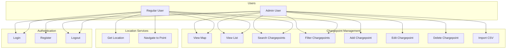
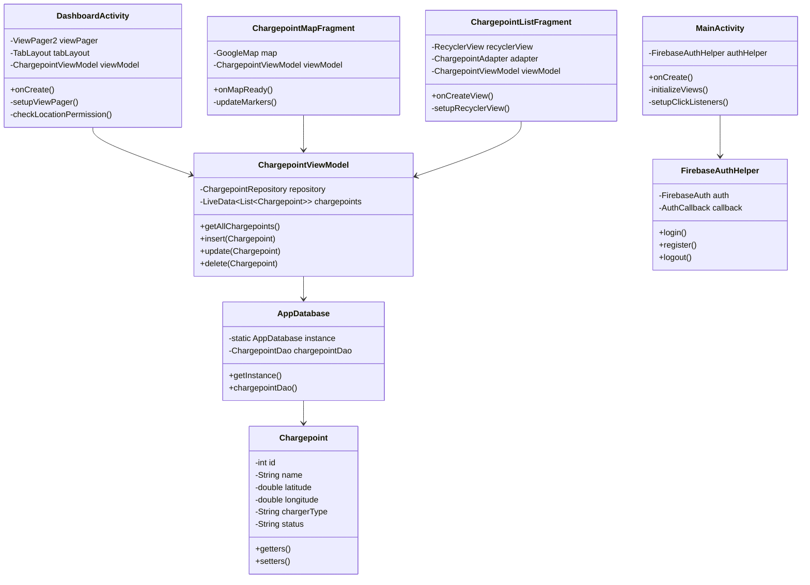
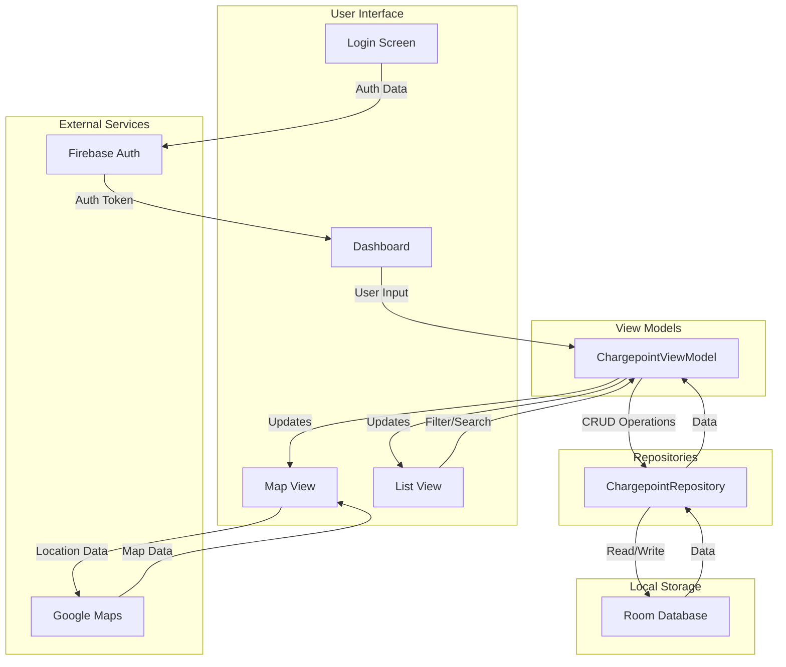

# Chargepoint App

An Android application for locating and managing electric vehicle charging points in West Yorkshire. This app allows users to view, search, and manage charging points through both list and map views.

## Features

- User authentication (login/register)
- Interactive map view of charging points
- Searchable list view of charging points
- Real-time charging point status updates
- Location-based services
- Admin interface for managing charging points

## Architecture

The app follows the MVVM (Model-View-ViewModel) architecture pattern and uses modern Android development practices.

### Core Components

#### Activities

1. **MainActivity**
   - Entry point of the application
   - Handles navigation to login/register screens
   - Checks authentication state

2. **DashboardActivity**
   - Main container activity after login
   - Manages ViewPager2 for switching between list and map views
   - Handles location permissions
   - Implements loading state management

3. **LoginActivity**
   - Handles user authentication
   - Validates user credentials
   - Manages Firebase Authentication

4. **RegisterActivity**
   - Handles new user registration
   - Validates registration data
   - Creates new Firebase Authentication accounts

#### Fragments

1. **ChargepointListFragment**
   - Displays searchable list of charging points
   - Implements filtering and sorting functionality
   - Handles CRUD operations for charging points

2. **ChargepointMapFragment**
   - Displays charging points on Google Maps
   - Handles map initialization and marker placement
   - Manages location services and permissions
   - Implements marker clustering for better performance

#### ViewModels

1. **ChargepointViewModel**
   - Manages charging point data
   - Handles database operations
   - Provides data to UI components
   - Implements data transformation and filtering

#### Data Classes

1. **Chargepoint**
   - Model class for charging point data
   - Contains location, status, and type information
   - Implements Room Entity for database storage

#### Database

1. **AppDatabase**
   - Room database implementation
   - Manages local data persistence
   - Handles database migrations
   - Implements singleton pattern

2. **DatabaseInitializer**
   - Handles initial database setup
   - Populates default data
   - Manages background initialization

#### Adapters

1. **ChargepointAdapter**
   - RecyclerView adapter for charging point list
   - Handles item click events
   - Implements filtering and sorting

2. **DashboardPagerAdapter**
   - ViewPager2 adapter for main dashboard
   - Manages fragment lifecycle
   - Handles tab switching

#### Authentication

1. **FirebaseAuthHelper**
   - Wrapper for Firebase Authentication
   - Manages user sessions
   - Handles login/logout operations
   - Implements callback pattern for auth state

#### Utilities

1. **CsvImporter**
   - Handles CSV file import
   - Parses charging point data
   - Validates import format

## UML Diagrams

### Use Case Diagram



### Class Diagram



### Data Flow Diagram



## Dependencies

- AndroidX Core and AppCompat
- Google Maps Android SDK
- Firebase Authentication
- Room Database
- ViewPager2
- Material Design Components
- RecyclerView
- LiveData and ViewModel

## Setup

1. Clone the repository
2. Add your Google Maps API key to `local.properties`:
   ```
   MAPS_API_KEY=your_api_key_here
   ```
3. Configure Firebase:
   - Add your `google-services.json` to the app directory
   - Enable Email/Password authentication in Firebase Console

## Building and Running

1. Open the project in Android Studio
2. Sync project with Gradle files
3. Build the project
4. Run on an emulator or physical device

## Architecture Diagram

```
┌─────────────────┐     ┌──────────────────┐     ┌─────────────────┐
│     Views       │     │   ViewModels     │     │     Models      │
│  (Activities &  │◄────┤                  │◄────┤                 │
│   Fragments)    │     │                  │     │                 │
└─────────────────┘     └──────────────────┘     └─────────────────┘
         ▲                       ▲                        ▲
         │                       │                        │
         │                       │                        │
         │               ┌──────────────────┐            │
         └───────────────┤  Repositories    ├────────────┘
                         │                  │
                         └──────────────────┘
                                 ▲
                                 │
                    ┌──────────────────────┐
                    │    Local Database    │
                    │      (Room DB)       │
                    └──────────────────────┘
```

## Contributing

1. Fork the repository
2. Create a feature branch
3. Commit your changes
4. Push to the branch
5. Create a Pull Request
